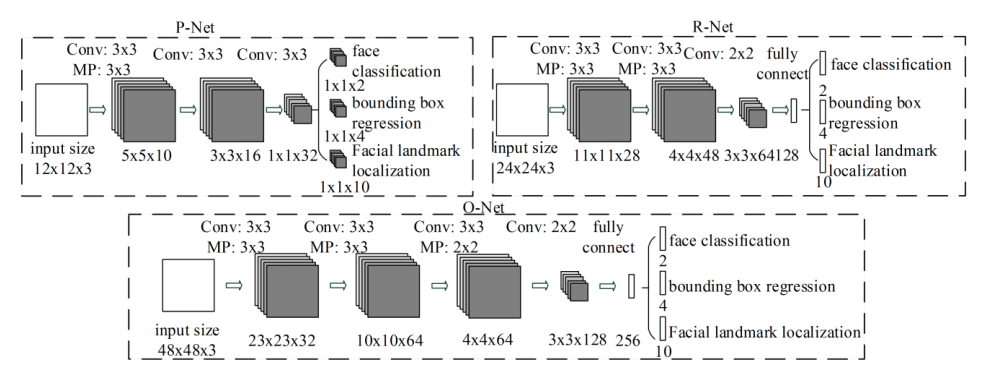

Python Face Detection
([Pre-requisites](https://github.com/Dotmole/face-detection-algorithms/blob/master/README.md) | [Wiki](https://github.com/Dotmole/face-detection-algorithms/wiki/Python))

1. MTCCN
 - The model is adapted from the Facenet's MTCNN implementation
 - The detector returns a list of JSON objects. Each JSON object contains three main keys: 'box', 'confidence' and 'keypoints'
 - Each of P-Net, R-Net and O-Net implementation can be found as methods of class [NetworkFactory](https://github.com/ipazc/mtcnn/blob/master/mtcnn/network/factory.py)
 
